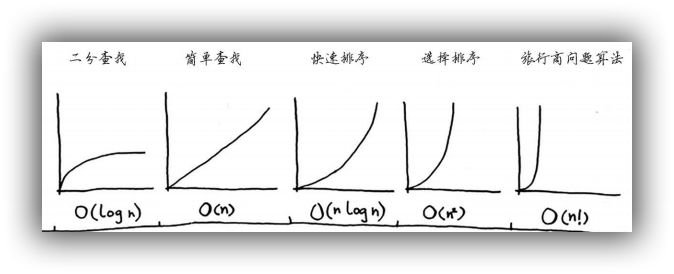

# 大O表示法

Big O notation

大 $O$ 表示法用于指出操作次数随 $n$ 的增大是如何变化的，被用于衡量算法的速度。从变化的方式中可以看出操作次数的增速，操作次数增速慢的算法速度更快。以 $O(\log_{2}n)$ 为例，可见操作次数与 $n$ 成对数关系——注意 $\log_{2}n$ 不一定等于算法的实际操作次数。因此， $O(\log_{2}n)$ 比 $O(n)$ 快，当需要搜索的元素越多时，前者比后者快得越多。 

另外，大 $O$ 表示法指出的是**最糟情况**下的运行时间。通常会使用时间复杂度渐近上界，也就是 $O(f (n))$ 来表示时间复杂度。

除最糟情况下的运行时间外，还应考虑平均情况的运行时间 ——关于平均运行时间，可查看笔记 “排序算法 > 4. 快速排序 VS 合并排序” 。

关于常量的作用，也可参考笔记 “排序算法 > 4. 快速排序 VS 合并排序” 。

常见的的时间复杂度：

- $O(\log_{2}n)$，也叫对数时间，例如：二分查找。
- $O(n)$，也叫线性时间，例如：简单查找。
- $O(n\log_{2}n)$，例如：快速排序算法最优情况、合并排序算法。
- $O(n^2)$，例如：选择排序算法、快速排序算法。
- $O(n!)$，例如：旅行商问题。 

