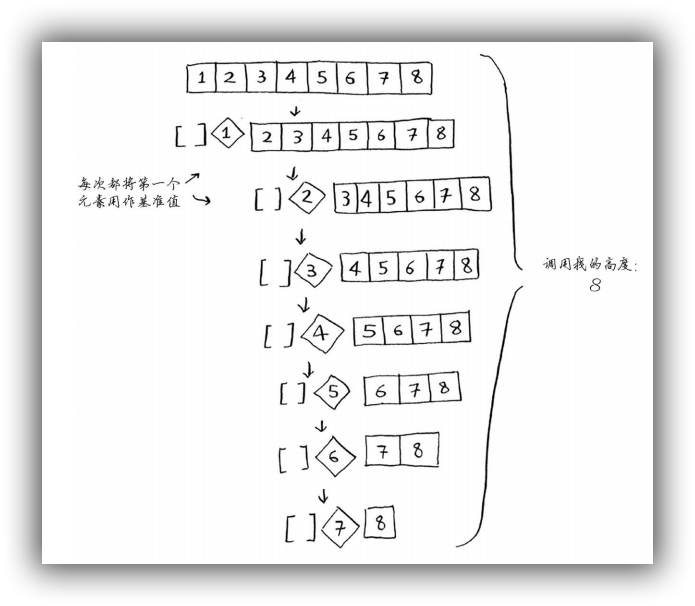
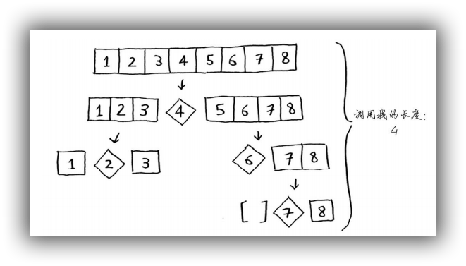

# 排序算法

## 1.选择排序法

在 Python 中分别用循环和递归实现选择排序。
选择排序的时间复杂度是 $O(n^2)$ 

### 1.1. 循环方式

```python
# -*- coding: utf-8 -*-
def selection_sort_l(a_list: list):
    """
    选择排序，循环方式
    将数组元素按从小到大的顺序排列
    :param a_list:
    :return:
    """
    for n in range(len(a_list)):
        for i in range(n + 1, len(a_list)):
            if a_list[i] < a_list[n]:
                a_list[n], a_list[i] = a_list[i], a_list[n]
    return a_list


if __name__ == '__main__':
    print(selection_sort_loop([9, 8, 1, 3, 2, 10, 7]))
```

### 1.2. 递归方式

- 基线条件：数组只包含一个元素，直接返回该数组即可
- 递归条件：每次从数组中剔除索引为0的最小值，对剩下部分继续执行选择排序

```python
# -*- coding: utf-8 -*-
def selection_sort_r(a_list: list):
    """
    选择排序，递归方式
    将数组元素按从小到大的顺序排列
    :param a_list:
    :return:
    """
    if len(a_list) <= 1:  # 基线条件
        return a_list
    # 递归条件
    for i in range(1, len(a_list)):
        if a_list[i] < a_list[0]:
            a_list[0], a_list[i] = a_list[i], a_list[0]
    return [a_list[0]] + selection_sort_r(a_list[1:])


if __name__ == '__main__':
    print(selection_sort_recursive([9, 8, 1, 3, 2, 10, 7]))
```

## 2. 快速排序法

Quicksort

快速排序采用了分治策略的思想，其速度比选择排序法快得多，C 语言标准库中 `qsort` 函数就是利用快速排序法实现的。

快速排序法的速度取决于基准值的选择，最坏时间复杂度为 $O(n^2)$ ，此时调用栈的高度为 $O(n)$；最优时间复杂度为 $O(n\log_{2}n)$ ，此时调用栈的高度为 $O(\log_{2}n)$。

合并排序(merge sort) 的排序算法，时间复杂度为 $O(n\log_{2}n)$ 。

快速排序的步骤：

1. 基准值(pivot)：首先从数组中随机选择一个元素作为基准值(pivot)
2. 分区(partitioning)：将比基准值大的元素和比基准值小的元素分别放到两个子数组中，同时将基准值也放到一个数组中，并按数组中平均值的大小排列这三个分组
3. 递归：对子数组递归调用快速排序函数

```python
# -*- coding: utf-8 -*-
# 快速排序算法


def quick_sort(a_list: list):
    if len(a_list) <= 1:  # 基线条件
        return a_list
    #  通过递归缩小问题规模
    pivot = a_list[0]
    less = [i for i in a_list[1:] if i <= pivot]
    greater = [i for i in a_list[1:] if i > pivot]
    return quick_sort(less) + [pivot] + quick_sort(greater)


if __name__ == '__main__':
    print(quick_sort([5, 3, 6, 2, 7, 1, 2, 3]))
    print(quick_sort([]))
```


## 3. 合并排序法

merge sort

合并排序法的时间复杂度 $$O(n\log_{2}n)$$ 比快速排序法低，但其执行数度比快速排序慢。
合并排序法调用栈的高度为 $$O(\log_{2}n)$$ 。

算法示意图如下：


自序列的合并过程如下图所示：


```python
# -*- coding: utf-8 -*-
# 合并排序(merge sort)，也称归并排序


def merge_sort(a_list: list):
    result = []
    if len(a_list) < 2:
        return a_list
    mid = len(a_list) // 2
    left = merge_sort(a_list[:mid])
    right = merge_sort(a_list[mid:])
    l = 0
    r = 0
    while l < len(left) and r < len(right):
        if left[l] < right[r]:
            result.append(left[l])
            l += 1
        else:
            result.append(right[r])
            r += 1
    result += left[l:]
    result += right[r:]
    return result


if __name__ == '__main__':
    print(merge_sort([8, 4, 5, 7, 1, 3, 8, 9]))
```

### **参考**

- [Mergesort Python](https://stackoverflow.com/questions/18761766/mergesort-python) -- stackoverflow
- [Merge Sort](https://www.codeproject.com/Articles/805587/Merge-Sort) -- codeproject
- [python实现归并排序，归并排序的详细分析](http://www.cnblogs.com/Lin-Yi/p/7309143.html)
- [图解排序算法(四)之归并排序](http://www.cnblogs.com/chengxiao/p/6194356.html)
- [分治法之合并排序算法理解介绍](https://blog.csdn.net/qq_26071477/article/details/51637324)

## 4. 快速排序 VS 合并排序

### 4.1. 快速排序

快速排序法的速度取决于基准值的选择。其最坏时间复杂度为 $O(n^2)$ ，此时调用栈的高度为 $O(n)$；最优时间复杂度为 $O(n\log_{2}n)$ ，此时调用栈的高度为 $O(\log_{2}n)$。

如果总是将第一个元素用作基准值，且要处理的数组是有序的。由于快速排序算法不检查输入数组是否有序，因此它依然尝试对其进行排序，此时便会遇到**最糟糕的情况**，**调用栈的高度为** $O(n)$ ，每层调用栈的时间复杂度是  $O(n)$ ，所以最坏时间复杂度为 $O(n^2)$ 。
在这种情况下，数组并没有被分成两半，但其中一个子数组始终为空，这导致调用栈非常长。




现在假设你总是将中间的元素用作基准值，便会遇到**最优情况**，此时调用栈的高度为 $O(\log_{2}n)$，每层调用栈的时间复杂度是  $O(n)$ ，所以最优时间复杂度为 $O(n\log_{2}n)$ ，



可见最优情况的调用栈比最坏的情况短的多，由于每次都将数组分成两半，所以减少了递归调用的次数，因此很快便可达到基线条件。另外，**最佳情况**也是**平均情况**，因为最佳情况的时间复杂度远小于最坏情况的时间复杂度。
因此，只要你每次都随机地选择一个数组元素作为基准值，快速排序的**平均操作次数**将为 $O(n log n)$ 。快速排序是最快的排序算法之一，也是D&C典范。 

### 4.2. 合并排序

合并排序(merge sort) 的排序算法，时间复杂度为 $O(n\log_{2}n)$ ，调用栈的高度为 $\log_{2}n$ 。

### 4.3. 常量的作用

通常无需考虑常量，因为如果两种算法的大 $O$ 运行时间不同，常量将无关紧要。例如，在比较简单查找和二分查找时，常量便几乎无关紧要，因为列表很长时，$\log_{2}n$ 的速度比$O(n)$ 快得多。 

但是，大 $O$ 表示法中的常量有时候非常重要，这就是快速排序比合并排序快的原因所在。 由于快速查找的**常量**比合并查找小，因此如果它们的时间复杂度都为 $O(n\log_{2}n)$，快速查找的速度将更快。 实际上，快速查找的速度确实更快，相对于遇上最糟情况，它遇上平均情况的可能性要大得多。 


