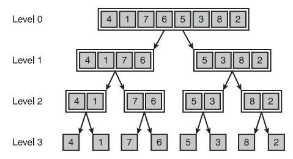

# 排序算法

[TOC]

Tips：为了保持简洁，每个函数都只处理整数列表，并且假设列表不为空。

> 参考：
>
> - 《数据结构（Python 语言描述）》 - 3.4 基本排序算法、3.5 更快的排序
> - [Sorting algorithm Wikipedia](https://en.wikipedia.org/wiki/Sorting_algorithm)
> - [排序算法 Wikipedia](https://zh.wikipedia.org/wiki/排序算法) 
>

## 术语

### 1. In-place

[In-place algorithm](https://en.wikipedia.org/wiki/In-place_algorithm) - [原地算法](https://zh.wikipedia.org/wiki/%E5%8E%9F%E5%9C%B0%E7%AE%97%E6%B3%95)。这种类型的算法在对输入数据进行处理时，不会使用额外的辅助数据结构。但是，允许辅助变量使用少量额外的存储空间（可理解为，不占用额外内存或占用常数的内存） 。在执行算法时，输出数据通常会覆盖输入数据。In-place 算法仅会通过替换元素或交换元素的方式来更新数据。下面这个逆向排序数组的示例演示了 In-place 和 out-of-place。

```
# 伪代码：out-of-place算法
 function reverse(a[0..n])
     allocate b[0..n]
     for i from 0 to n
         b[n - i] = a[i]
     return b

# 上面的函数需要O(n)的额外空间来创建数组b，并且数组的分配和释放操作通常很是缓慢。
# 如果在倒序后，不再需要数组a，便可采用In-place算法，如下：
function reverse-in-place(a[0..n])
     for i from 0 to floor(n/2)
         swap(a[i], a[n-i])
```

### 2. 稳定性 

Stable sort

> 参考：
>
> - [Sorting_algorithm#Stability](https://en.wikipedia.org/wiki/Sorting_algorithm#Stability)
> - [排序算法#穩定性](https://zh.wikipedia.org/wiki/%E6%8E%92%E5%BA%8F%E7%AE%97%E6%B3%95#%E7%A9%A9%E5%AE%9A%E6%80%A7)

稳定性排序(stable-sort)算法在对相同元素进行排序时，不会改变这些元素在排序之前的相对位置。比如当我们按照牌面值进行排序时：在稳定性排序中，红心 5 和黑桃 5 的前后顺序保持不变；而在非稳定性算法中，两者的顺序则可能会发生改变。


### 3. 分治策略

Divide and Conquer

[分支策略](https://zh.wikipedia.org/wiki/%E5%88%86%E6%B2%BB%E6%B3%95)：简单来说就是将一个复杂的问题分解为多个相同的子问题。然后，再次对这些子问题进行分解，直至所得的子问题可直接求解为止。原问题的阶便是这些子问题的解的合并。这个技巧是很多高效算法的基础，如[排序算法](https://zh.wikipedia.org/wiki/%E6%8E%92%E5%BA%8F%E7%AE%97%E6%B3%95)（[快速排序](https://zh.wikipedia.org/wiki/%E5%BF%AB%E9%80%9F%E6%8E%92%E5%BA%8F)、[归并排序](https://zh.wikipedia.org/wiki/%E5%BD%92%E5%B9%B6%E6%8E%92%E5%BA%8F)）、[傅立叶变换](https://zh.wikipedia.org/wiki/%E5%82%85%E7%AB%8B%E5%8F%B6%E5%8F%98%E6%8D%A2)（[快速傅立叶变换](https://zh.wikipedia.org/wiki/%E5%BF%AB%E9%80%9F%E5%82%85%E7%AB%8B%E5%8F%B6%E5%8F%98%E6%8D%A2)）。 

在每一层递归上都有三个步骤：

1. 分解：将原问题分解为若干个规模较小，相对独立，与原问题形式相同的子问题。
2. 解决：若子问题规模较小且易于解决时，则直接解。否则，递归地解决各子问题。
3. 合并：将各子问题的解合并为原问题的解。

## 基本排序算法

本节介绍的算法虽容易编写，但效率不高；下一节介绍的算法都很难编写，但是更为高效。

### 1.选择排序法

[Selection Sort](https://zh.wikipedia.org/wiki/%E9%80%89%E6%8B%A9%E6%8E%92%E5%BA%8F#%E5%A4%8D%E6%9D%82%E5%BA%A6%E5%88%86%E6%9E%90)

特点：In-place sort & Unstable sort 

算法描述如下：

首先在未排序序列中找到最小（大）元素，存放到已排序序列的起始位置，然后，再从剩余未排序元素中继续寻找最小（大）元素，然后放到已排序序列的末尾。以此类推，直到所有元素均排序完毕。 选择排序每次遍历未排序序列时，会通过比较来确定最值的位置，并在遍历完毕后将该值存放到已排序序列的末尾。

选择排序的主要优点与数据移动有关。如果某个元素位于正确的最终位置上，则它不会被移动。选择排序每次主循环可能会交换一对元素，它们当中至少有一个将被移到其最终位置上，因此对 $n$ 个元素的表进行排序总共进行至多 $n-1$ 次交换。在所有的完全依靠交换去移动元素的排序方法中，选择排序属于非常好的一种。 

选择排序在各种情况下的复杂度均为 $О(n²)$ ：最坏时间复杂度 $О(n²)$，最优时间复杂度 $О(n²)$，平均时间复杂度 $О(n²)$。对于较大的数据集，交换各项的开销可能也很显著。由于数据项的交换只是在外围循环中进行，所以在最坏情况和平均情况下，选择排序的这一额外开销都是线性的。

下图是选择排序的示例动画


不稳定性：假设被排序的列表是 `[6,8,6,3,9]`，经排序后两个 6 的前后顺序会发生交换。

#### 1.1. 循环方式

利用 `for` 循环实现选择排序：

```python
def selection_sort_for(lyst: list):
    """
    用for循环实现选择排序，将数组元素按升序排列
    """
    for i in range(len(lyst)-1):
        min_index = i
        for j in range(i+1, len(lyst)):
            if lyst[j] < lyst[min_index]:
                min_index = j
        if min_index != i:
            lyst[i], lyst[min_index] = lyst[min_index], lyst[i]
```

利用 `while` 循环实现选择排序：

```python
def selection_sort_while(lyst: list):
    """
    用while循环实现选择排序，将数组元素按升序排列
    """
    i = 0
    while i < len(lyst)-1:  # 循环n-1次
        min_index = i
        j = i+1
        while j < len(lyst):
            if lyst[j] < lyst[min_index]:
                min_index = j
            j += 1
        if min_index != i:
            lyst[i], lyst[min_index] = lyst[min_index], lyst[i]
        i += 1
```

以上两个函数均包含了一个嵌套的循环。对于大小为 $n$ 的列表，外循环执行 $n-1$ 次。第一次执行外循环时，内循环执行 $n-1$ 次；第二次执行外循环时，内循环执行 $n-2$ 次；以此类推，最后一个执行外循环时，内循环执行 $1$ 次。因此对于大小为 $n$ 的列表，总比较次数为：
$$
(n-1)+(n-2)+...+1 = n(n-1)/2=\frac{1}{2}(n^2-n)
$$
如果 $n$ 非常大，便可忽略系数和一次项，仅保留二次项 $n^2$。因此，选择排序在各种情况下的复杂度均为 $О(n²)$ 。

#### 1.2. 递归方式

- 基线条件：列表只包含一个元素，直接返回该列表即可
- 递归条件：每次从列表中剔除索引为0的最小值，对剩下部分继续执行选择排序

```python
def selection_sort(lyst: list):
    """
    用递归实现选择排序，将数组元素按升序排列
    """
    if len(lyst) == 1:
        return lyst
    min_index = 0
    for i in range(1, len(lyst)):
        if lyst[i] < lyst[min_index]:
            min_index = i
    if min_index != 0:
        lyst[0], lyst[min_index] = lyst[min_index], lyst[0]
    return [lyst[0]] + selection_sort(lyst[1:]) # 非原地(out-of-place)


print(selection_sort([9, 8, 1, 3, 2, 10, 7]))
```

### 2. 冒泡排序

Bubble Sort

特点：In-place sort & Stable sort 

算法描述如下：

从列表的顶端开始，逐一比较相邻的两个元素，直到列表末尾为止。每当两个相邻元素间顺序不正确时，便交换其位置。这个过程的产生的效果便是将最大的项以冒泡的方式逐渐移动到列表的末尾。然后，再以相同的方式重新遍历列表，直到倒数第二个元素为止。以此类推，直到所有元素均排序完毕。 注意，与"选择排序"不同，"冒泡排序"中列表已排序好的部分是从列表的尾部朝着列表的顶端逐渐延伸的。


冒泡排序在各种情况下的复杂度均为 $О(n²)$ ：
对于大小为 $n$ 的列表，总比较次数为 $\frac{1}{2}(n^2-n)$。和选择排序一样，如果列表是已经排序好的，冒泡排序不会执行任何交换工作。不过，在最坏情况下，冒泡排序的交换工作会超过线性方式，因为交换发生在内循环之中。

#### 2.1. 循环方式

利用 `for` 循环实现选择排序：

```python
def bubble_sort_for(lyst: list):
    """
    用for循环实现冒泡排序，将数组元素按升序排列
    每次内循环会将最大的项以冒泡的方式逐渐移至列表的末尾
    """
    for i in range(len(lyst)-1):
        for j in range(1, len(lyst)-i):
            if lyst[j-1] > lyst[j]:
                lyst[j-1], lyst[j] = lyst[j], lyst[j-1]

# 注意，与常规将最大项冒泡至列表尾部的方式不同，
# 下面这个函数将最小项冒泡至列表顶部
def bubble_sort_for_(lyst: list):
    """
    用for循环实现冒泡排序，将数组元素按升序排列
    每次内循环会将最小的项以冒泡的方式逐渐移至列表的顶端
    """
    for i in range(len(lyst)-1):
        for j in range(len(lyst)-1, i, -1):
            if lyst[j-1] > lyst[j]:
                lyst[j-1], lyst[j] = lyst[j], lyst[j-1]
```

利用 `while` 循环实现选择排序：

```python
def bubble_sort_while(lyst: list):
    """
    用while循环实现冒泡排序，将数组元素按升序排列
    每次内循环会将最大的项以冒泡的方式逐渐移至列表的末尾
    """
    n = len(lyst)
    while n > 1:
        i = 1
        while i < n:
            if lyst[i-1] > lyst[i]:
                lyst[i-1], lyst[i] = lyst[i], lyst[i-1]
            i += 1
        n -= 1
```

##### 2.1.1. 改进算法

如果对之前的函数进行一点调整，可将冒泡算法在最好情况下的性能提高到线性阶 $O(n)$ ——最好的情况是指被排序的序列已经是有序序列，但出现的可能性非常低(概率是 $1/n!$)。注意，这种调整只改进了最好情况下的复杂度；不过，在平均情况下冒泡排序的复杂度仍然更接近于 $O(n^2)$ 。

```python
def bubble_sort_while_(lyst: list):
    """
    用while循环实现冒泡排序，将数组元素按升序排列
    每次内循环会将最大的项以冒泡的方式逐渐移至列表的末尾

    如果在执行内循环时，并没有发生交换，那么说明被内循环遍历的这部分列表项是有序的。
    这种情况可能发生在主循环的任意轮次，但最好的情况是第一次就没有发生任何交换。
    """
    n = len(lyst)
    while n > 1:
        is_swapped = False # 跟踪是否发生转换
        i = 1
        while i < n:
            if lyst[i-1] > lyst[i]:
                lyst[i-1], lyst[i] = lyst[i], lyst[i-1]
                is_swapped = True
            i += 1
        if not is_swapped:
            return
        n -= 1
```

#### 2.2. 递归方式

```python
def bubble_sort(lyst: list):
    """
    用递归实现冒泡排序，将数组元素按升序排列
    每次内循环会将最大的项以冒泡的方式逐渐移至列表的末尾
    """
    if len(lyst) == 1:
        return lyst
    for i in range(1, len(lyst)):
        if lyst[i-1] > lyst[i]:
            lyst[i-1], lyst[i] = lyst[i], lyst[i-1]
    return bubble_sort(lyst[:-1]) + [lyst[-1]] # 非原地(out-of-place)


print(bubble_sort([9, 8, 1, 3, 2, 10, 7]))
```

### 3. 插入排序

Insertion Sort 

特点：In-place sort & Stable sort 

一般来说，**插入排序**都采用in-place在数组上实现（即只需用到 $O(1)$ 的额外空间的排序，因而在从后向前扫描过程中，需要反复把已排序元素逐步向后挪位，为最新元素提供插入空间）。算法描述如下：

1. 从第一个元素开始，该元素可以认为已经被排序
2. 取出下一个元素，在已经排序的元素序列中从后向前扫描
3. 如果该元素（已排序）大于新元素，将该元素移到下一位置
4. 重复步骤3，直到找到已排序的元素小于或者等于新元素的位置
5. 将新元素插入到该位置后
6. 重复步骤2~5


对于大小为 $n$ 的列表，外循环执行 $n-1$ 次。
在最坏情况下，列表中所有数据均为乱序，内部循环在外围循环的第 1 个轮次迭代 1 次；在第 2 个轮次迭代 2 次，之后依次类推，一共需要  $\frac{1}{2}(n^2-n)$ 次。因此，插入排序的最坏情况的复杂度是 $O(n^2)$。
列表中的原本就排好的项越多，插入排序的效果越好。最好情况下，列表本身就是有序的，那么插入排序的复杂度是线性阶 $O(n)$。在平均情况下插入排序的复杂度仍是 $O(n^2)$。

另外，如果比较操作的代价比交换操作大的话，还可以采用[二分查找法](https://zh.wikipedia.org/wiki/%E4%BA%8C%E5%88%86%E6%9F%A5%E6%89%BE%E6%B3%95)来减少比较操作的数目。由此便产生了插入排序的一个变种，即[二分查找插入排序](https://zh.wikipedia.org/w/index.php?title=%E4%BA%8C%E5%88%86%E6%9F%A5%E6%89%BE%E6%8F%92%E5%85%A5%E6%8E%92%E5%BA%8F&action=edit&redlink=1)。 

#### 3.1. 循环方式

利用 `for` 循环实现选择排序：

```python
def insertion_sort_for(lyst: list):
    """
    用for循环实现插入排序，将数组元素按升序排列
    """
    for i in range(1, len(lyst)):
        item_to_insert = lyst[i]
        for j in range(i-1, -1, -1):
            if item_to_insert < lyst[j]:
                lyst[j+1] = lyst[j]
            else:
                j += 1
                break
        lyst[j] = item_to_insert
```

利用 `while` 循环实现选择排序：

```python
def insertion_sort_while(lyst: list):
    """
    用while循环实现插入排序，将数组元素按升序排列
    """
    i = 1
    while i < len(lyst):
        item_to_insert = lyst[i]
        j = i - 1
        while j >= 0:
            if item_to_insert < lyst[j]:
                lyst[j+1] = lyst[j]
                j -= 1
            else:
                break
        lyst[j+1] = item_to_insert
        i += 1
```

#### 3.2. 递归方式

```python
def insertion_sort(lyst: list):
    """
    用递归实现插入排序，将数组元素按升序排列
    """
    if len(lyst) == 1:
        return lyst
    item_to_insert = lyst[-1]
    sub_lyst = insertion_sort(lyst[:-1])+[item_to_insert] #非原地(out-of-place)
    for i in range(len(sub_lyst)-2, -1, -1):
        if item_to_insert < sub_lyst[i]:
            sub_lyst[i+1] = sub_lyst[i]
        else:
            i += 1
            break
    sub_lyst[i] = item_to_insert
    return sub_lyst


print(insertion_sort([9, 8, 1, 3, 2, 10, 7]))
```

## 更快的排序

要想得到复杂度更低的排序算法，可采用分治策略。这种排序算法，在理想情况下调用栈的高度是 $log_2n$ ，重新排列每一个子列表的工作量是 $n$。因此，算法的复杂度是 $O(nlog_2n)$ ，这样便突破了基本排序算法 $O(n^2)$ 的障碍。 

### 1. 快速排序

Quicksort

特点：In-place sort & Unstable sort，也可实现为 Out-of-place。

[快速排序](https://zh.wikipedia.org/wiki/快速排序)采用了分治策略的思想，其速度比选择排序法快得多，C 语言标准库中 `qsort` 函数就是利用快速排序法实现的。算法描述如下：

1. 基准值(pivot)：首先从列表中随机选择一个元素作为基准值。注意，快速排序的速度取决于基准值的选择，虽然很少出现最坏的情况，但是也要尽量避免。选取第一个或最后一个元素作为基准点并不明智，使用中间元素或随机位置更加合理(测试发现，使用中间值的性能快于随机值)
2. 分区(partition)：重新排序列表，将小于基准值和大于基准值的元素分为两个列表。所有比基准值小的元素摆放在基准值前面，所有比基准值大的元素摆在基准值后面（相同的数可以到任何一边）。如果在进行分区时，发现基准值是最大项，那么其余元素都会被放置到基准值之前；如果基准值是最小项，则其余元素会被放置在基准值之后。但是，无论基准值最终位置如何，该位置都是它的最终位置。
3. 递归：对上述两个子列表递归应用上述过程。
4. 基线条件：当子列表只包含一个元素，停止递归。

将快速排序实现为递归算法时，还需考虑调用栈所使用的内存。每次递归调用都需要一个固定大小的内存用于栈，并且在每一次分区之后又会进行两次递归调用。因此，在最好情况下，内存的栈深是 $O(log_2n)$ ；在最坏情况下，内存的栈深是 $O(n)$ 。

快速排序的最坏时间复杂度为 $O(n^2)$ ，此时调用栈的高度为 $O(n)$。最坏如下图所示，假设总是将第一个元素用作基准值，且要处理的数组是有序的。由于快速排序算法不检查输入数组是否有序，因此它依然尝试对其进行排序，此时便会遇到**最糟糕的情况** 。在这种情况下，数组并没有被分成两半，但其中一个子数组始终为空，这导致调用栈非常长。


最优时间复杂度为 $O(n\log_{2}n)$ ，此时调用栈的高度为 $O(\log_{2}n)$。假设总以中间元素用作基准值，那么就算是遇见有序列表，也是最优情况。如下图所示：


可见最优情况的调用栈比最坏的情况短的多，由于每次都将数组分成两半，所以减少了递归调用的次数，因此很快便可达到基线条件。因为最佳情况的时间复杂度远小于最坏情况的时间复杂度，所以最佳情况也是平均情况
因此，只要每次都随机地选择一个元素作为基准值，快速排序的平均操作次数将为 $O(nlog_2n)$ 。快速排序是最快的排序算法之一，也是分治策略的典范。 

#### 1.1.  in-place 实现

原地(in-place)分区版本：该版本中 `partition ` 函数的的工作原理如下图所示，并假设最初选定的基准值是 5。


```python
import random
def quicksort_in(lyst: list):
    quicksort(lyst, 0, len(lyst)-1)


def quicksort(lyst, left, right):
    if left < right:
        pivot_index = partition(lyst, left, right)
        quicksort(lyst, left, pivot_index-1)
        quicksort(lyst, pivot_index+1, right)


def partition(lyst, left, right):
    # pivot_index = (left+right)//2
    pivot_index = random.randint(left, right)
    lyst[right], lyst[pivot_index] = lyst[pivot_index], lyst[right]
    boundary = left
    for index in range(left, right):
        if lyst[index] < lyst[right]:
            lyst[boundary], lyst[index] = lyst[index], lyst[boundary]
            boundary += 1
    lyst[boundary], lyst[right] = lyst[right], lyst[boundary]
    return boundary


lyst = [3, 7, 8, 5, 2, 1, 9, 6]
quicksort_in(lyst)
print(lyst)
```

#### 1.2.  out-of-place 实现

非原地(out-of-place)分区版本：该版本的缺点是需要额外的存储空间，但是实现过程简单。在实际实现过程中，配置额外的存储器空间，会极度影响速度和[缓存](https://zh.wikipedia.org/wiki/%E5%BF%AB%E5%8F%96)的性能。 

```python
def quicksort_out(lyst: list):
    if len(lyst) <= 1:  # 基线条件
        return lyst
    # 选取基准值
    pivot = lyst[len(lyst)//2]
    less = [i for i in lyst[1:] if i <= pivot] #非原地(out-of-place)
    greater = [i for i in lyst[1:] if i > pivot] #非原地(out-of-place)
    #  通过递归缩小问题规模
    return quicksort_out(less) + [pivot] + quicksort_out(greater)


print(quicksort_out([5, 3, 6, 2, 7, 1, 2, 3]))
```

### 2. 合并排序

Merge Sort

> 参考：
>
> - [Mergesort Python](https://stackoverflow.com/questions/18761766/mergesort-python) -- stackoverflow
> - [Merge Sort](https://www.codeproject.com/Articles/805587/Merge-Sort) -- codeproject
> - [图解排序算法(四)之归并排序](http://www.cnblogs.com/chengxiao/p/6194356.html)

特点：Out-of-place & Stable sort

合并排序也称归并排序，指的是将两个已经排序的序列合并成一个序列的操作。
算法描述如下：

1. 递归：计算一个列表的中点，并且递归地对中点以上和中点以下的部分进行排序——利用分治策略缩小问题规模。
2. 基线条件：当子列表只包含一个元素，停止递归
3. 归并：将两个已排序好的子列表重新合并为一个有序列表

合并排序在各种情况下的复杂度均为 $О(nlog_2n)$ ：最坏时间复杂度 $О(nlog_2n)$，最优时间复杂度 $О(nlog_2n)$，平均时间复杂度 $О(nlog_2n)$。虽然合并排序在最坏情况下优于快速排序，但其执行速度仍比快速排序慢。

算法的工作原理如下图所示：


下图展示了该算法的动态过程：


#### 2.1. 实现

```python
def merge_sort(lyst: list):
    def sort_helper(lyst, copy_buffer, low, high):
        """辅助函数，隐藏额外参数"""
        if low < high:
            mid = (low+high)//2
            sort_helper(lyst, copy_buffer, low, mid)
            sort_helper(lyst, copy_buffer, mid+1, high)
            merge(lyst, copy_buffer, low, mid, high)

    def merge(lyst, copy_buffer: list, low, mid, high):
        """实现合并过程"""
        low_index = low  # 低位子序列第一项的索引
        high_index = mid + 1  # 高位子序列第一项的索引
        i = low # 被填充的索引值
        while low_index <= mid and high_index <= high:
            if lyst[low_index] <= lyst[high_index]:
                copy_buffer[i] = lyst[low_index]
                low_index += 1
            else:
                copy_buffer[i] = lyst[high_index]
                high_index += 1
            i += 1
        if low_index <= mid:
            copy_buffer[i:high+1] = lyst[low_index:mid+1]
        elif high_index <= high:
            copy_buffer[i:high+1] = lyst[high_index:high+1]
        lyst[low:high+1] = copy_buffer[low:high+1]

    copy_buffer = lyst[:] # 临时缓冲区
    sort_helper(lyst, copy_buffer, 0, len(lyst)-1)


lst1 = [3, 7, 8, 5, 2, 1, 9, 6]
lst2 = [5, 3, 6, 2, 7, 1, 2, 3]
merge_sort(lst1)
merge_sort(lst2)
print(lst1)
print(lst2)
```

下图展示了对拥有 8 个元素的列表递归调用 `sort_helper` 函数的过程(注意，在该示例中，子类表在每一个层级都都平均划分。因此，在第 $k$ 层便有 $2^k$ 个子列表需要被合并。如果列表的长度不是 2 的幂，便无法在每一个层级都做到完全平均地划分，并且最后的层级中将不会拥有足够的子列表)。



下图展示了调用 `merge` 函数进行合并的过程，通过下图可观察到，在同一层次中所有合并操作所花费的时间是 $O(n)$ ，层数是 $O(log_2n)$ 


上述合并排序的实现有两个空间需求：在调用栈上需要 $O(log_2n)$ 的空间；临时缓冲区需要 $O(n)$ 的空间 。 `copy_buffer` 就是合并过程中使用的临时缓冲区。如果将 `copy_buffer` 置于 `merge` 函数， 那么每次调用 `merge` 时，都会为 `copy_buffer` 重新分配和释放内存；如果将 `copy_buffer` 置于主函数中，则可避免这些额外的开销，仅需将其作为参数传递即可。

不过，如果将临时缓冲区放置在 `merge` 内，则可以简化实现：

```python
from collections import deque

def merge_sort(lst):
    if len(lst) <= 1:
        return lst

    def merge(left, right):
        # 使用队列作为临时缓冲区
        merged,left,right = deque(),deque(left),deque(right)
        while left and right:
            merged.append(left.popleft() if left[0] <= right[0] else right.popleft())  # deque popleft is also O(1)
        merged.extend(right if right else left)
        return merged

    middle = int(len(lst) // 2)
    left = merge_sort(lst[:middle])
    right = merge_sort(lst[middle:])
    return merge(left, right)
```

#### 2.2. 常量的作用

通常无需考虑常量，因为如果两种算法的大 $O$ 运行时间不同，常量将无关紧要。例如，在比较简单查找和二分查找时，常量便几乎无关紧要，因为列表很长时，$O(log_2n)$ 的速度比$O(n)$ 快得多。 

但是，大 $O$ 表示法中的常量有时候非常重要，这就是快速排序比合并排序快的原因所在。 由于快速查找的**常量**比合并查找小，因此如果它们的时间复杂度都为 $O(n\log_{2}n)$，快速查找的速度将更快。 实际上，快速查找的速度确实更快，相对于遇上最糟情况，它遇上平均情况的可能性要大得多。 


