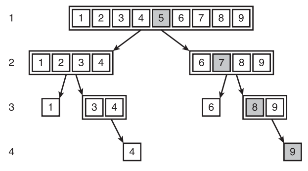

# 搜索算法

[TOC]

> 参考：《数据结构（Python 语言描述）》 - 3.3 搜索算法

学习思路按照以下三个层次推进：学习算法设计思路 >> 实现算法 >> 复杂度分析

Tips：为了保持简洁，每个函数都只处理整数列表，并且假设列表不为空。

## 搜索最小值

Search for the Minimum

下面这个函数会返回列表中最小项的索引，该算法在最好、最坏和平均情况下的复杂度均为 $O(n)$ 。

```python
def index_of_min(lyst):
    """返回最小项的索引"""
    min_index = 0
    current_index = 1
    while current_index < len(lyst):
        if lyst[current_index] < lyst[min_index]:
            min_index = current_index
        current_index += 1
    return min_index
```

## 顺序搜索

顺序搜索(Sequential Search)，也称线性搜索(linear search)。

如果需要在对象上使用 `in` 进行成员测试，则需要为该对象实现 [`__contains__()`](https://docs.python.org/3/reference/datamodel.html#object.__contains__) 方法。如果对象中包含指定项，返回 `True` ；否则返回 `False` 。下面这个顺序搜索函数，实现了与列表中 [`__contains__()`](https://docs.python.org/3/reference/datamodel.html#object.__contains__) 方法类的功能。

```python
def sequential_search(target, lyst):
    """如果找到目标项，返回其索引；否则返回-1"""
    position = 0
    while position < len(lyst):
        if target == lyst[position]:
            return position
        position += 1
    return -1
```

### 最好情况、最坏情况、平均情况

Best-Case, Worst-Case, and Average-Case Performance Revisited 

有些算法的性能与数据的排列方式有关，比如顺序搜索算法。此时，我们可以分三种情况考虑考虑该算法的性能：

1. 最坏情况：对于"顺序搜索"而言，在最坏情况下，目标项位于列表末尾，或根本不在列表之中。此时必须访问列表中的每一项，对大小为 $n$ 的列表要执行 $n$ 次迭代。因此，顺序搜索在最坏的情况下复杂度为 $O(n)$ 。
2. 最好情况："顺序搜索"只进行一次迭代就在第一个位置找到了目标项，复杂度为 $O(1)$ 。
3. 平均情况：需要把从"最好情况"到"最坏情况"间可能出现的所有情况的迭代次数相加，并除以 $n$。因此，算法平均执行了 $(1+2+3+...+n-1+n)/n$ 次迭代，化简后等于 $(n+1)/2$ 。对于很大的 $n$ 而言，常数因子 $2$ 的作用并不大。因此，平均情况的复杂度仍然为 $O(n)$ 。

## 二叉搜索

Binary Search

二叉搜索也称二分查找，该算法针对有序列表，其时间复杂度是 $O(\log_{2}n)$ 。

假设我们需要利用二叉搜索查找某个按照升序排列的列表。首先，二叉算法会找出位于列表中间位置的中间项，并将该项与目标项进行比较：如果两者一致，便返回中间项的索引；如果目标项小于中间项，则继续搜索列表的前半部分；反之，则搜索后半部分。当找到目标，或当索引的起点值大于终点值时停止搜索。

注意，使用二叉搜索时有一个额外的整体性代价，就是必须保持列表的有序性。

下面分别使用"循环方式"和"递归方式"来实现二叉搜索。

### 循环方式

```python
# -*- coding: utf-8 -*-
def binary_search_loop(sorted_list: list, target: int):
    """
    二分查找，循环方式
    :param sorted_list: 按升序排列的列表
    :param target: 被查找的目标项
    :return: 如果sorted_list中包含target，返回target的索引值，否则返回None
    """
    low = 0
    high = len(sorted_list) - 1
    while low <= high:
        mid_point = (low + high) // 2
        if sorted_list[mid_point] == target:
            return mid_point
        elif sorted_list[mid_point] > target:
            high = mid_point - 1
        else:
            low = mid_point + 1
    return None


if __name__ == '__main__':
    my_list = [1, 2, 3, 4]
    assert binary_search_loop(my_list, 1) == 1
    assert binary_search_loop(my_list, 2) == 1
    assert binary_search_loop(my_list, 3) == 2
    assert binary_search_loop(my_list, 4) == 3
    assert binary_search_loop(my_list, 10) is None
```

### 递归方式

- 基线条件：数组只包含一个元素，如果目标值与该元素相同，便在最终的基线条件下找到了目标值，否则目标值不在数组中。
- 递归条件：每次把数组分成两半，并丢弃其中的一半，对剩下的一半再次执行二分查找。

```python
# -*- coding: utf-8 -*-
def binary_search_recursive(sorted_list: list, target: int):
    """
    二分查找，递归方式
    :param sorted_list: 按升序排列的列表
    :param target: 被查找的目标项
    :return: 如果sorted_list中包含target，返回target的索引值，否则返回None
    """
    mid = (len(sorted_list) - 1) // 2
    if len(sorted_list) == 1:  # 基线条件
        if target == sorted_list[0]:
            return 0
        else:
            return None
    elif target == sorted_list[mid]:  # 基线条件
        return mid
    # 下面的代码，通过递归逐步缩减问题规模
    if target > sorted_list[mid]:
        index = binary_search_recursive(sorted_list[mid + 1:], target)
        if index is None:
            return None
        # 减半后的新列表sorted_list[mid + 1:]会重新以索引0开头，
        # 这里需要保证返回的索引值包含当前sorted_list列表的索引信息，
        # 因此需要重新调整index中的索引值。
        # 要将index中的索引值调整到sorted_list列表中的对应位置，
        # 需要为index加上(mid + 1)
        return index + (mid + 1)
    else:
        index = binary_search_recursive(sorted_list[:mid], target)
        return index


if __name__ == '__main__':
    assert binary_search_recursive(my_list, 1) == 0
    assert binary_search_recursive(my_list, 2) == 1
    assert binary_search_recursive(my_list, 3) == 2
    assert binary_search_recursive(my_list, 4) == 3
    assert binary_search_recursive(my_list, 10) is None
```

### 最坏情况

当目标项不在列表中的时候，便会出现最坏情况。在最坏情况下，对于大小为 $n$ 的列表，会持续将列表长度除以 2，直至商为 1 时停止(如， $n//2//...//2 = 1$ )——其中除法执行的次数便是循环执行的总次数。假设除法执行的次数为 $k$ ，那么便有 $n/2^k=1$ ，可得 $k=log_2n$ 。因此，二叉搜索最坏情况的复杂度为 $O(log_2n)$ 。 

下图展示了在仅含 1~9 的整数列表中，用二叉搜索查找整数 10 的过程。灰色项表示中间项，用于和目标项进行比较，也就是会被访问的项。另外，位于初始列表前半部分的项，实际上并不会被访问。




