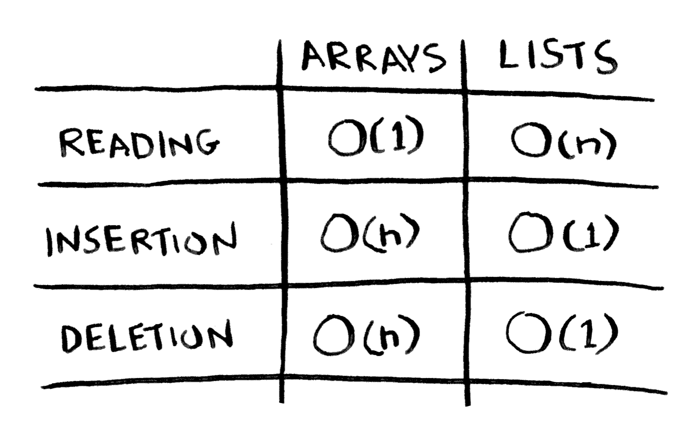

# 数组和链表

## 数组

数组中的数据被存储在内存中首尾相连的成片区域中。

如果数组中的内容不断增多，那么当数组需要的内存区域大于当前区域时，就需要为数组重新分配一块更大的首尾相连的成片区域，数组中的所有数据都将被移动到新的内存区域中。

由于数组中每个元素的地址都是已知的，所以在随机地读取元素时，数组的效率会很高，因为可迅速找到数组的任何元素。

在同一个数组中，所有元素的类型都必须相同（都为int、 double等）。 

## 链表

链表中的元素可存储在内存中的任何地方。
链表中的每个元素都会存储下一个元素的地址，从而使一系列随机的内存地址串接在一起形成一个列表。因此，如果链表中的内容不断增多，也不会需要为链表重新分配更大的整块内存区域，只需要为新数据逐个分配独立的内存区域即可。

特点：

- 链表只能顺序访问
- 需要同时读取链表中的所有元素时，链表的效率很高。
- 需要随机读取链表中元素时，链表的效率很低。在链表中，元素并未位于连续的内存区域中，无法在随机读取过程中迅速知道目标元素的具体地址，必须沿着链表逐一查找。

## 对比

下面列出了常见的数组和链表操作的运行时间。 

<u>Tips：</u>仅当能够立即访问要插入或删除的元素时，插入或删除操作的运行时间才为O(1)。通常我们都记录了链表的第一个元素和最后一个元素，因此在这两个位置插入或删除元素时运行时间为O(1)。 