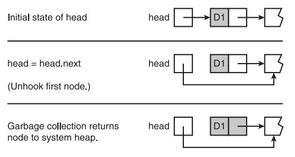

# 数组和链表结构

[TOC]


> 参考：《数据结构（Python 语言描述）》- 第4章 数组和链表

在编程语言中，最常用来实现集合(collection)的两种数据结构是数组和链表结构。这两种类型的结构采用不同的方法在计算内存中存储和访问数据。也正是由于这些不同的方法，导致了操作这两种结构的算法存在不同的时间/空间取舍。由此，我们需要了解数据结构，以明白不同的数据结构对算法的影响。

## 1. 术语

本节中的一些概念并非特定于 Python，比如 Python 中并没有类似于 C/C++ 中的数组(array)类型，所以在看到这些类型时，请以 C/C++ 的视角进行思考。

"数据结构"和"具体数据类型(CDT)"这两个术语，指的是集合的数据(collection's data)的内部表示——集合是一种抽象数据类型(ADT)。比如对于栈(stack)这种 ADT 集合，在其内部可使用数组或链存储数据，那么此时讨论的"数据结构"和"具体数据类型(CDT)"便是针对数组或链表进行的。另外，随着视角的变换也可将 ADT 集合直接视作"数据结构"，比如我们常说栈是一种先进后出的数据结构，便是在思考栈这种"数据结构"的特征，而非是在讨论栈内部数据元素具体采用的"数据结构"。

### 1.1 数据结构

数据结构(data structure)是一种组织和存储数据的方式，它包含了数据值的集合、数据间的关系，以及可应用于数据之上函数或操作。常见数据结构如：数组、链表、栈、队列。

下图展示了哈希表([hash table](https://en.wikipedia.org/wiki/Hash_table))的数据结构：


Tips：为什么数组即是数据结构，又是数据类型？
数据结构是一种解决问题的思路，而数据类型是这种思路的具体实现。在讨论"数据结构"时，我们是在研究这种结构的具体特性，比如使用了连续的内存、支持随机访问等；在讨论数据类型时，我们是在讨论这种类型使用方法，比如支持索引操作。

> 参考：[数据结构：数组、链表、栈、队列的理解](https://www.cnblogs.com/jimoer/p/8783604.html)

### 1.2 具体数据类型

具体数据类型(Concrete Data Type，CDT)是 ADT 的实际实现方式，比如栈(ADT 类型)可由数组(CDT 类型)实现。数组(array)、链表(linked list)和树(tree) 均属于 CDT，它们都是基本数据结构，通常由计算机语言提供。

> 参考：
> [Examples of Concrete and Abstract Data Types](https://course.ccs.neu.edu/cs5010f17/InterfacesClasses2/concrete2.html?) 
> [Concrete data type vs Abstract data type (data structures)](http://www.cplusplus.com/forum/beginner/220104/)

### 1.3 抽象数据类型

抽象数据类型(Abstract Data Type，ADT)不单纯是一组值的集合，还包括作用在值集上的操作的集合，在"构造数据类型(Structured data types)"的基础上同时增加了对数据的操作，并且类型的表示细节及操作的实现细节对外是不可见得——在 C 语言中，构造数据类型包括 数组(array)、结构体(struct)、联合体 (union)、枚举(enum)。

之所以命名为抽象数据类型，就是因为外部只知道它做什么，而不知道它如何做，更不知道数据的内部表示细节。 这样，即使改变数据的表示和操作的实现，也不会影响程序的其他部分。抽象数据类型可达到更好的信息隐藏效果，因为它使程序不依赖于数据结构的具体实现方法，只要提供相同的操作，换用其他方法实现时，程序无需修改，这个特征对于系统的维护很有利。 

同一个数据结构可以实现为 1 或多个抽象数据类型。比如，哈希表这种数据结构，便可能由于哈希函数的不同而产生不同的实现，从而形成多个不同的抽象数据类型。栈(stack)、队列(queue)和堆(heap) 也属于抽象数据结构。

要实现某个 ADT 必须以某个恰当的 CDT 为基础，进行实现。比如，栈和队列可以由数组或链表实现；堆可以由数组或二叉树(binary tree)实现。

## 2.  数组数据结构

Array Data Structure

由于在许多编程语言中，集合中的实现结构主要是数组，而不是列表。因此，我们需要熟悉用数组的方式来思考问题，本节内容就是在要帮助我们了解如何利用数组实现集合，以及对部分操作进行复杂度分析。

Python 的 array 模块虽提供了 array 类，但该类与其它编程语言中的数组存在很大的区别，其行为更类似于列表，而且仅能存储数值。因此，为了讨论数组数据结构，我们将自定义一个 Array 类(下文中提及的数组都特指该自定义类)，具体定义如下：

```python
"""
File: arrays.py

An Array is a restricted list whose clients can use
only [], len, iter, and str.

To instantiate, use

<variable> = array(<capacity>, <optional fill value>)

The fill value is None by default.
"""

class Array(object):
    """Represents an array."""

    def __init__(self, capacity, fillValue = None):
        """Capacity is the static size of the array.
        fillValue is placed at each position."""
        self._items = list()
        for count in range(capacity):
            self._items.append(fillValue)

    def __len__(self):
        """-> The capacity of the array."""
        return len(self._items)

    def __str__(self):
        """-> The string representation of the array."""
        return str(self._items)

    def __iter__(self):
        """Supports iteration over a view of an array."""
        return iter(self._items)

    def __getitem__(self, index):
        """Subscript operator for access at index."""
        return self._items[index]

    def __setitem__(self, index, newItem):
        """Subscript operator for replacement at index."""
        self._items[index] = newItem

```

### 2.1 随机访问和连续内存

计算机通过为数组分配一段连续的内存单位，从而支持对数组的随机访问。

索引操作便属于随机访问，其步骤如下：

1. 获取数组内存块的基本地址——数组第1项的机器地址
2. 给这个地址加上索引，返回最终结果。

### 2.2 物理尺寸和逻辑尺寸

物理尺寸：表示数组的最大容量，就是在创建数组时用于指定数组容量的数值。

逻辑尺寸：表示在数组中已填充了多少项。如果逻辑尺寸为了0，则表示数组为空；如果逻辑尺寸不为 0，则最后一项的索引为逻辑尺寸减 1。

在操作数组时，由程序员负责记录数组的逻辑尺寸和物理尺寸。
逻辑尺寸和物理尺寸的比值被称作数组的装载因子(load factor)，

### 2.3 数组的操作

这一节会在数组上实现几种常见操作，这些操作数组的方法应位于包含数组的集合中，集合利用这些方法操作其内部的数组。分析这些常见操作的目的是为了解其运行时间的复杂度，以便在利用不同的数据结构实现集合时，可以有效对比不同数据结构间的优劣。

本节之后的示例中，会假设存在如下初始数据设置：

```python
class ListCollection(object):
    DEFAULT_CAPACITY = 5  # 默认容量

    def __init__(self):
        self.logical_size = 0  # 逻辑尺寸
        self._array = Array(ListCollection.DEFAULT_CAPACITY)
    # --snip--
```

#### a. 增加数组的尺寸

当插入新的项时，数组的逻辑尺寸等于物理尺寸，便需要增加数组的尺寸。

```python
    def increase_size(self):
        if self.logical_size == len(self._array):
            temp = Array(len(self._array)+1)
            for i in range(self.logical_size):
                temp[i] = self._array[i]
            self._array = temp
            # 旧数组的内存留给垃圾回收程序处理
```

采用上述代码增加数组尺寸时，复制操作的次数是线性的 $O(n)$ 。如果需要给数组添加 $n$ 项，那么整体的时间性能是 $n(n+1)/2$ ，即 $O(n^2)$ 。考虑下述方案，每次将数组大小翻倍，从而将整体时间性能优化为 $O(log_2n)$ ，但这样做会以浪费内存为代价。

```python
    temp = Array(len(a_array)*2)
```

#### b. 减少数组的尺寸

当数组的逻辑尺寸小于某个阈值时，就应当缩小其物理尺寸，以避免浪费大量内存。

```python
    def decrease_size(self):
        if self.logical_size <= len(self._array)//4 and \
                len(self._array) >= ListCollection.DEFAULT_CAPACITY*2:
            temp = Array(len(self._array)//2)
            for i in range(self.logical_size):
                temp[i] = self._array[i]
            self._array = temp
```

#### c. 在数组中插入一项

```python
    def insert_item(self, target_index, target_item):
        self.increase_size() # 检查是否需要增加数组尺寸
        # 从最后一项开始以逐个向后移动
        for i in range(self.logical_size, target_index, -1):
            self._array[i] = self._array[i-1]
        self._array[target_index] = target_item
        self.logical_size += 1
```

在插入过程中，移动项的时间性能在平均情况下是线性的，因此，插入操作的时间性能是线性的。

#### e. 从数组中删除一项

```python
    def remove_item(self, target_index, target_item):
        # 从目标项之后的一项开始，逐个向前移动
        for i in range(target_index, self.logical_size-1):
            self._array[i] = self._array[i+1]
        self.logical_size -= 1
        # 检测是否需要减少物理尺寸
        self.decrease_size()
```

由于移动一项的事件性能平均是线性的，因此，删除操作的时间性能是线性的。

### 2.4 复杂度分析

下表给出了数组操作的运行时间：

| 操作                    | 运行时间                   |
| ----------------------- | :------------------------- |
| 访问第 $i$ 个位置的元素 | $O(1)$，最好情况和最坏情况 |
| 替换第 $i$ 个位置的元素 | $O(1)$，最好情况和最坏情况 |
| 从逻辑末尾插入          | $O(1)$，平均情况           |
| 从逻辑末尾删除          | $O(1)$，平均情况           |
| 在第 $i$ 个位置插入     | $O(n)$，平均情况           |
| 从第 $i$ 个位置删除     | $O(n)$，平均情况           |
| 增加容量                | $O(n)$，最好情况和最坏情况 |
| 减小容量                | $O(n)$，最好情况和最坏情况 |

可见数组提供了对已经存在的项的快速访问，并且提供了在逻辑末尾位置的快速插入和删除。然而，在任意位置的插入和删除可能会慢上一个量级。调整大小所需时间也是线性阶，但是如果调整每次变化的倍率，则能够优化所需时间。 

### 2.5 完整示例

综合上面的代码，以下是利用数组实现集合的一个完整示例：

```python
class ListCollection(object):
    DEFAULT_CAPACITY = 5  # 默认容量

    def __init__(self):
        self.logical_size = 0  # 逻辑尺寸
        self._array = Array(ListCollection.DEFAULT_CAPACITY)

    def increase_size(self):
        if self.logical_size == len(self._array):
            temp = Array(len(self._array)+1)
            for i in range(self.logical_size):
                temp[i] = self._array[i]
            self._array = temp
            # 旧数组的内存留给垃圾回收程序处理

    def decrease_size(self):
        if self.logical_size <= len(self._array)//4 and \
                len(self._array) >= ListCollection.DEFAULT_CAPACITY*2:
            temp = Array(len(self._array)//2)
            for i in range(self.logical_size):
                temp[i] = self._array[i]
            self._array = temp

    def insert_item(self, target_index, target_item):
        self.increase_size()
        for i in range(self.logical_size, target_index, -1):
            self._array[i] = self._array[i-1]
        self._array[target_index] = target_item
        self.logical_size += 1

    def remove_item(self, target_index):
        # 从目标项之后的一项开始，逐个向前移动
        for i in range(target_index, self.logical_size-1):
            self._array[i] = self._array[i+1]
        self.logical_size -= 1
        # 检测是否需要减少物理尺寸
        self.decrease_size()

    def __len__(self):
        # 逻辑长度
        return self.logical_size

    def __getitem__(self, item):
        if item < self.logical_size:
            return self._array[item]

    def __setitem__(self, key, value):
        self.increase_size()
        self._array[key] = value
        self.logical_size += 1

    def __str__(self):
        return str(self._array[:self.logical_size])
```

### 2.6 二维数组

利用之前定义的 Array 类，可以构建出二维数组 Grid 类，代码如下：

```python
"""
File: grid.py

仅能使用 [], str, getHeight 和 getWidth, 不提供迭代器
"""

from 数组数据结构 import Array


class Grid(object):
    """Represents a two-dimensional array."""

    def __init__(self, rows, columns, fillValue=None):
        self._data = Array(rows)
        for row in range(rows):
            self._data[row] = Array(columns, fillValue)

    def getHeight(self):
        """Returns the number of rows."""
        return len(self._data)

    def getWidth(self):
        "Returns the number of columns."""
        return len(self._data[0])

    def __getitem__(self, index):
        """Supports two-dimensional indexing with [][]."""
        return self._data[index]

    def __str__(self):
        """Returns a string representation of the grid."""
        result = ""
        for row in range(self.getHeight()):
            for col in range(self.getWidth()):
                result += str(self._data[row][col]) + " "
            result += "\n"
        return result


def main():
    g = Grid(10, 10, 1)
    print(g)
    # 重置二维列表
    for row in range(g.getHeight()):
        for column in range(g.getWidth()):
            g[row][column] = row*10 + column
    print(g)


if __name__ == "__main__":
    main()

```

## 3. 链表结构

Linked Structures    

在数组之后，链表结构可能使程序中最常用的数据结构。

### 3.1 单链表结构和双链表结构

单链表结构(Singly Linked Structure)和双链表结构(Doubly Linked Structure)是两种最简单的链表结构，其结构如下图所示：


单链表结构的用户通过外部的头链接(head link)可访问链表的第一个节点，然后根据该节点提供的信息，便可访问其后继项，并以此类推。在单链表结构中，很容易获取当前节点的后继项，但很难获取当前节点的前驱项。

双链表包含两个方向的链接，因此用户很容易获取当前项的前驱项和后继项。双链表还提供了名为尾链接(tail link)的外部链接，以便用户直接访问链表的最后一项。

两种链表的最后一项都不包含指向下一项的链接，这种情况被称为空链接(empty link)。双链表的第一项和最后一项都包含空链接。

链表结构无法通过索引直接访问其中的某项，必须从链表的第一项起沿着链表找寻目标索引。

### 3.2 非连续性内存和节点

数组使用的是连续内存，而链表是用的是非连续性内存(Noncontiguous Memory) 。

链表结构的基本单位是节点(node)，它包含了一个数据项和一个对后继项的引用。双链表的节点中还包含了一个对前驱项的引用。

注意，不同于 C++ 使用指针指向后继项，Python 直接引用后继项即可。在 Python 中变量可以引用任何内容，包括 None(表示空链接)。


### 3.3 定义单链表的节点类

Defining a Singly Linked Node Class Node

节点类很简单，其构造方法允许用户设置节点连接，不过节点对象通常不包含方法调用。

```python
class Node(object):

    def __init__(self, data, next=None):
        """Instantiates a Node with default next of None"""
        self.data = data
        self.next = next

    def __str__(self):
        return str(self.data)
        
# Just an None object
node1 = None

# A node containing data and an empty link
node2 = Node("A", None)

# A node containing data and a link to node2
node3 = Node("B", node2)
```

执行上述代码后，三个变量的状态如下图所示：


下面的代码展示了使用循环方式来创建一个链表结构，并访问其中的每一个节点。其中最新插入的项总位于链表前端。另外，当打印数据时，head 会重新指向下一个节点，直到 head 为 None 为止。因此，完成输出后，实际上会从链表中删除所有节点。对于程序来说，这些被删除的节点会在下一次垃圾回收的时候被回收。

```python
head = None
for count in range(1, 6):
    head = Node(count, head)

while head is not None:
    print(head)
    head = head.next
```

### 3.4 单链表结构的操作

几乎数组上的所有操作都是基于索引的，并且索引是数组结构中不可或缺的部分。但是，在链表结构中，程序员必须通过操作结构中的链表来模拟基于索引的操作。

#### a. 遍历

遍历(traversal)在时间上是线性的，并且不需要额外的内存。

```python
head = None
for count in range(3, 0, -1):
    head = Node(count, head)

probe = head
while probe is not None:
    # <use or modify probe.data >
    print(probe)
    probe = probe.next
```

遍历过程如下图所示：


#### b. 搜索和访问

顺序搜索和遍历类似，平均情况下对单链表结构的顺序搜索也是线性的。

```python
head = None
for count in range(3, 0, -1):
    head = Node(count, head)

# targetItem是被查找的目标项
probe = head
while probe is not None and targetItem != probe.data:
    probe = probe.next
if probe is not None:
    # <targetItem has been found>
else:
    # <targetItem is not in the linked structure>
```

和数组不同，链表结构不支持随机访问。因此，访问链表结构中的某一项，也是一次顺序搜索操作，如下是访问第 $i$ 项的代码：

```python
# 假定 0 <= index < n, index是目标索引项
probe = head
while index > 0:
    probe = probe.next
    index -= 1
return probe.data
```

#### c. 替换

以下两种替换操作在平均情况下都是线性的。

在单链表结构中，替换给定项的操作需要利用搜索操作：

```python
head = None
for count in range(3, 0, -1):
    head = Node(count, head)

# targetItem是被替换的目标项
probe = head
while probe is not None and targetItem != probe.data:
    probe = probe.next
if probe is not None:
    probe.data = newItem # 替换目标项的数据
    return True
else:
    return False
```

替换给索引位置的操作需要利用访问操作：

```python
# 假定 0 <= index < n, index是目标索引项
probe = head
while index > 0:
    probe = probe.next
    index -= 1
probe.data = newItem # 替换目标索引位置的数据
```

#### d. 在开始处插入

在一个链表结构的开始处插入项时，可分为以下两种情况：


- 第一种情况下，head 的初始状态就是 `None`，将 head 设置为新节点即可。
- 第二种情况下，不需要像数组那样复制并移动数据，也不需要额外的内存。

所以，在一个链表结构的开始处插入数据时，时间和内存都是常数，这与数组的操作过程截然不同。

#### e. 在末尾处插入

在一个数组的末尾插入一项时，需要的时间和内存都是常数，除非必须调整数组的大小。
在单链表结构的末尾插入时，需考虑以下两种情况：

- 第一种情况，head 的初始状态就是 `None`，将 head 设置为新节点即可。
- 第二种情况，当 head 初始状态不为 `None` 时，需要先遍历链表以获取链表的最后一个节点，然后再进行插入。该操作在时间上是线性的，在空间上是常数。

```python
newNode = Node(newItem)
if head is None:
	head = newNode
else:
	probe = head
	while probe.next != None:
		probe = probe.next
	probe.next = newNode
```

下图展示了在拥有 3 项元素的一个链表末尾插入新项的过程：


#### f. 从开始处删除

该操作的使用的时间和内存都是常数，和数组上的相同操作有明显区别。

```python
# Assumes at least one node in the structure
removedItem = head.data
head = head.next
return removedItem
```

下图记录了删除过程：



#### g. 从末尾处删除

从一个数组的末尾删除一项时，需要的时间和内存都是常数，除非必须调整数组的大小。
假设单链表中至少存在一个节点，从链表中删除最后一个节点时需要考虑以下两种情况：

- 第一种情况，只有一个节点，直接将 head 指针设置为 `None` 即可
- 第二种情况，至少存在两个节点时，需要先找到倒数第二个节点，并将其 `next` 指针设置为 `None` 。

```python
# Assumes at least one node in structure
removedItem = head.data
if head.next is None:
	head = None
else:
	probe = head
	while probe.next.next != None:# 找到倒数第二项
		probe = probe.next
	removedItem = probe.next.data
	probe.next = None
return removedItem
```

下图展示了从拥有 3 个项的链表结构中删除最后一项的过程：


#### h. 在任何位置插入

在数组的第 $i$ 个索引位置插入一项时，需要先将从索引 $i$ 到 $n-1$ 的项都向后移动。
在链表的第 $i$ 个索引位置插入项时，需要先找到第 $i-1$ (如果 $i<n$) 或 $n-1$ (如果 $i>=n$)的索引位置，然后插入一个节点。和遍历操作一样，该操作的性能也是线性的，但使用的内存数是常数。

```python
if head is None or index <= 0:
	head = Node(newItem, head)
else:
	# Search for node at position index - 1 or the last position
    probe = head
    j = 0
    while j <= index-2 and probe.next != None:
        probe = probe.next
        j += 1
    # Insert new node after node at position index - 1
    # or last position
    probe.next = Node(newItem, probe.next)
```

下图展示了在包含 3 个项的链表结构中，在第 2 个索引位置插入一项的过程： 


在目标项之前插入一项：

```python
if head is not None:
    if head.next is None and\
            targetItem == head.data:
        # 链表中仅有一个元素，且该元素等于目标项
        head = Node(newItem, head)
    else:
        probe = head
        while probe.next is not None and\
                targetItem != probe.next.data:
            probe = probe.next
        if probe.next is not None:
            probe.next = Node(newItem, probe.next)
else:
    # 不存在目标项时的操作
```

#### i. 从任意位置删除

从一个链表结构中删除索引值是 $i$ 的项，存在以下三种情况：

- $i<=0$ ，直接删除索引为 0 的节点
- $0<i<n$ ，找到索引为 $i-1$ 的节点，然后删除其后的节点
- $i>=n$ ，直接删除最后一个节点

```python
# 假设链表结构中至少包含一个节点
if index <= 0 or head.next is None
	removedItem = head.data
    head = head.next
    return removedItem # 返回被删除的节点
else:
    # Search for node at position index - 1 or
    # the next to last position
    probe = head
    while index > 1 and probe.next.next != None:
        probe = probe.next
        index -= 1
    removedItem = probe.next.data
    probe.next = probe.next.next
    return removedIte
```

下图展示了从包含 4 个节点链表结构中删除索引为 2 的节点的过程：


### 3.5 复杂度分析

下表给出了单链表各种操作的运行时间：

| 操作                    | 运行时间                   |
| ----------------------- | :------------------------- |
| 访问第 $i$ 个位置的元素 | $O(n)$，平均情况           |
| 替换第 $i$ 个位置的元素 | $O(n)$，平均情况           |
| 在开始处插入            | $O(1)$，最好情况和最坏情况 |
| 从开始处删除            | $O(1)$，最好情况和最坏情况 |
| 在第 $i$ 个位置插入     | $O(n)$，平均情况           |
| 从第 $i$ 个位置删除     | $O(n)$，平均情况           |

单链表只有两个操作在时间上不是线性的。单链表结构相较数组的主要优点并不是时间性能，而是内存性能。当必须调整数组的尺寸时，其时间和内存都是线性的。当调整链表结构的尺寸时(插入或删除操作都会伴随链表尺寸的改变)，其时间和内存都是常数。因为链表结构的物理尺寸和逻辑尺寸相等，所有在链表结构中没有浪费内存的问题。链表结构有一个额外的内存代价，因为单链表结构必须要为指针使用 `n` 个内存单元。这种代价在双链表结构中还会翻倍，因为双链表的节点有两个链接。

### 3.6 链表的变体

#### a. 包含哑头结点的循环链表结构

对于单链表结构，在其开始处插入(删除)节点的操作，其实是在任意位置插入(删除)节点的特殊情况——特殊之处在于 head 引用需要被改变。如果使用带哑头节点(Dummy Header Node)的循环链表结构，便可避免这种特殊性，从而在任何情况下都无需改变 head 引用的对象。

首先，循环链表结构的最后一个节点的链接总会引用第一个节点；其次，这个实现中第一个节点始终是哑头节点——哑头节点不包含数据，用于充当链表结构中开头和结尾的一个标志——并且 head 始终会引用哑头节点。在该实现的空链表结构中，哑头节点的链接会引用哑头节点自身。空链表结构如下：

```python
head = Node(None, None)
head.next = head
```

示意图如下：


本实现的数据节点位于哑头节点之后，并且最后一个数据节点的链接需要引用哑头节点。另外，数据节点的索引依然从 0 开始。下图展示了包含一个数据节点的实现：


执行在任意索引位置插入节点的操作时，本实现的代码如下：

```python
# Search for node at position index - 1 or the last position
probe = head
j = 0
while j+1 <= index and probe.next != head:
    probe = probe.next
    j += 1
# Insert new node after node at position index - 1 or
# last position
probe.next = Node(newItem, probe.next)
```

可见，本实现的优点在于插入(删除)操作都只需要考虑一种情况。

#### b. 双链表结构

由于双链表包含两个方向的链接，因此可获取当前项的前驱项和后继项。由于尾链接(tail link)的存在，使得用户可以直接访问最后一个节点。


通过扩展之前的 Node 类，便可实现双链表结构的节点类：

```python
class Node(object):
    def __init__(self, data, next = None):
        """Instantiates a Node with default next of None"""
        self.data = data
        self.next = next
class TwoWayNode(Node):
    def __init__(self, data, previous = None, next = None):
        """Instantiates a TwoWayNode."""
        Node.__init__(self, data, next)
        self.previous = previous
```

构建双链表的代码如下：

```python
"""File: testtwowaynode.py
Tests the TwoWayNode class.
"""
from node import TwoWayNode
# Create a doubly linked structure with one node
head = TwoWayNode(1)
tail = head
# Add four nodes to the end of the doubly linked structure
for data in range(2, 6):
    # 通过尾链接添加节点，同时会修改尾连接的引用。
    # 前提是链表非空，并且tail始终引用链表的最后一个节点。
    tail.next = TwoWayNode(data, tail)
    tail = tail.next
# Print the contents of the linked structure in reverse order
probe = tail
while probe != None:
    print(probe.data)
    probe = probe.previous
```

下图展示了在双链表结构的末尾插入一个新节点的过程：


双链表结构较为通用的插入和删除操作也存在两种情况，这点与单链表的操作相同，可以通过借助带有哑头节点的循环链表来简化插入和删除操作。

除了在尾部插入和删除的操作，双链表结构其余操作的时间复杂度与单链表的对应操作相同。不过，双链表结构中额外的指针，需要一个额外的。线性的内存使用量。


