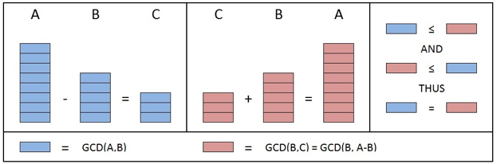

# 欧几里德算法

The Euclidean Algorithm 
又称辗转相除法

最大公约数 Greatest Common Divisor (GCD)：整数 A 和 B 的最大公约数是指能够同时整除 A 和 B 的最大整数。
欧几里德算法是一种用于快速寻找两个整数的最大公约数的技巧。

## 1. 算法

使用欧几里德算法寻找 GCD(A,B) 的过程如下：

- 如果 A=0，那么 GCD(A,B)=B，因为 GCD(0,B)=B，并停止寻找
- 如果 B=0，那么 GCD(A,B)=A，因为 GCD(A,0)=A，并停止寻找
- 将 A 写作商和余数的形式 (A = B⋅Q + R)
- 使用欧几里德算法寻找 GCD(B,R)，因为 GCD(A,B) = GCD(B,R)

## 2. 证明

欧几里德算法使用了下述特性：

- GCD(A,0) = A
- GCD(0,B) = B
- 如果 A = B⋅Q + R 并且 B≠0 那么 GCD(A,B) = GCD(B,R) ，这里的 Q 是一个整数，R 是位于 0 ~ (B - 1) 之间的整数。

如果 A 和 B 其中一个为 0，便可利用前两个特性得出 GCD。
第三个特性帮助我们将大而复杂的问题化简为小而容易解决的问题。
欧几里德算法先利用第三个特性迅速化简问题，直至可以通过前两个特性求解为止。

### GCD(A,0)=A

**证明 GCD(A,0)=A** 的过程如下：

- 均分(evenly divide) A 的最大整数是 A
- 因为任意整数 C ⋅ 0 = 0，所以 0 可以被所有整数均分，因此 A 一定可均分 0
- 综上，能够均分 A 和 0 的最大整数即是 A，所以 GCD(A,0)=A

**GCD(0,B)=B** 的证明过程与此类似，区别仅在于用 B 替换 A。

### GCD(A,B)=GCD(B,A-B)

先证明较简单的 GCD(A,B)=GCD(B,A-B)，再证明 GCD(A,B)=GCD(B,R)

假设现在有三个整数 **A,B** 和 **C** 并且满足 **A-B=C**。

#### 证明 GCD(A,B) 均分 C

根据定义 GCD(A,B) 可均分 A。因此，A 一定是 GCD(A,B) 的倍数，即 X⋅GCD(A,B)=A ，此处的 X 是某个整数。
根据定义 GCD(A,B) 可均分 B。因此，B 一定是 GCD(A,B) 的倍数，即 Y⋅GCD(A,B)=B ，此处的 Y 是某个整数。

根据 A-B=C 可得出：

- X⋅GCD(A,B) - Y⋅GCD(A,B) = C
- (X - Y)⋅GCD(A,B) = C

由此可见 GCD(A,B) 可均分 C。
上图的左侧部分展示了此证明，提取如下：

#### 证明 GCD(B,C) 均分 A

根据定义 GCD(B,C) 可均分 B。因此，B 一定是 GCD(B,C) 的倍数，即 M⋅GCD(B,C)=B ，此处的 M 是某个整数。
根据定义 GCD(B,C) 可均分 C。因此，C 一定是 GCD(B,C) 的倍数，即 N⋅GCD(B,C)=B ，此处的 N 是某个整数。

根据 A-B=C 可得出:

- B+C=A
- M⋅GCD(B,C) + N⋅GCD(B,C) = A
- (M + N)⋅GCD(B,C) = A

由此可见 GCD(B,C) 可均分 A。
下图展示了此证明：

#### **证明 GCD(A,B)=GCD(A,A-B)**

- 根据定 GCD(A,B) 均分 B
- 同时，已证明 GCD(A,B) 均分 C
- 因此，GCD(A,B) 是 B 和 C 的公约数

由于 GCD(B,C) 是 B 和 C 的最大公约数，所以 GCD(A,B) 必须小于或等于 GCD(B,C)。

- 根据定义 GCD(B,C) 均分 B
- 同时，已证明 GCD(B,C) 均分 A
- 因此，GCD(B,C) 是 B 和 A 的公约数

由于 GCD(A,B) 是 A 和 B 的最大公约数，所以 GCD(B,C) 必须小于或等于 GCD(A,B)。

∵ GCD(A,B)≤GCD(B,C) 且 GCD(B,C)≤GCD(A,B) 
∴ GCD(A,B)=GCD(B,C) 即 GCD(A,B)=GCD(B,A-B)

下图的右侧部分展示了此证明的图示：

### 证明 GCD(A,B) = GCD(B,R)

前面已证明了 GCD(A,B)=GCD(B,A-B)
另外，对于 GCD( ) 而言，括号中各项的顺序并不重要，因此 GCD(A,B)=GCD(A-B,B)
那么，如果反复应用 GCD(A,B)=GCD(A-B,B)，便可得到：
GCD(A,B)=GCD(A-B,B)=GCD(A-2B,B)=GCD(A-3B,B)=...=GCD(A-Q⋅B,B)
由于 A= B⋅Q + R 可得 A-Q⋅B=R，所以 **GCD(A,B)=GCD(R,B)** 。
由于括号中各项的顺序并不重要，因此最终可得：**GCD(A,B)=GCD(B,R)**

## 3. 示例

找寻 270 和 192 的最大公约数：

A=270, B=192 

- A ≠0，B ≠0

- 使用长除法(long division)求得 270/192 = 1...78，并将此等式写作 270 = 192 * 1 +78
- 由于 GCD(270,192)=GCD(192,78)，所以继续寻找 GCD(192,78)

A=192, B=78

- A ≠0，B ≠0
- 使用长除法(long division)求得 192/78 = 2...36，并将此等式写作 192 = 78 * 2 + 36
- 由于 GCD(192,78)=GCD(78,36)，所以继续寻找 GCD(78,36)

A=78, B=36

- A ≠0，B ≠0
- 使用长除法(long division)求得 78/36 = 2...6，并将此等式写作 78 = 36 * 2 + 6
- 由于 GCD(78,36)=GCD(36,6)，所以继续寻找 GCD(36,6)

A=36, B=6

- A ≠0，B ≠0
- 使用长除法(long division)求得 36/6 = 6 ...0，并将此等式写作 36 = 6 * 6 + 0
- 由于 GCD(36,6)=GCD(6,0)，所以继续寻找 GCD(6,0)

A=6, B=0

- A ≠0
- B =0, GCD(6,0)=6

从上面的过程可以看出：
∵ GCD(270,192) = GCD(192,78) = GCD(78,36) = GCD(36,6) = GCD(6,0) = 6
∴ GCD(270,192) = 6

## 4. 参考

- [可汗学院 -- 欧几里得算法](https://www.khanacademy.org/computing/computer-science/cryptography/modarithmetic/a/the-euclidean-algorithm) -- 本文翻译自这篇文章
- [欧几里德算法(辗转相除)证明](http://www.cnblogs.com/Howe-Young/p/4329362.html) -- 并不能严谨的证明是最大公约数
- [欧几里德算法（最大公约数算法）](https://blog.csdn.net/canhui_wang/article/details/50760510) -- 并不能严谨的证明是最大公约数

