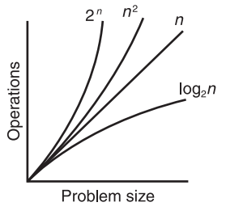

# 算法复杂度分析

[TOC]

复杂度分析 (complexity analysis)

> 参考：
>
> 《数据结构（Python 语言描述）》 - 3.2 复杂度分析

## 复杂度的阶

Orders of Complexity

算法的性能可通过复杂度的阶(order)来衡量。

复杂度的常见阶：

- Constant - 常数阶：该算法对于任何规模的问题，所用操作数相同。例如，列表索引属于常数时间算法，因为无论列表规模如何变化，需要的操作数却是恒定的。
- Linear( $n$ ) - 线性阶：例如，简单查找算法，逐个查找列表中的每一项。
- Quadratic ( $n^2$ ) - 平方阶：例如，选择排序算法，还有快速排序算法最坏情况。
- Polynomial ( $n^k$ ) - 多项式阶：$k$ 是大于 1 的常数，比如 $n^2$,  $n^3$, $n^{10}$ 。
- Logarithmic ( $log_2n$ )  - 对数阶：对数阶算法的工作量和问题规模的 $log_2$ 成比例，当问题规模翻倍时，工作量只增加 1。
- Exponential - 指数阶：例如，$2^n$ 属于指数阶。

下图表示了复杂度的部分阶：

## 大 O 表示法

Big-O Notation    

算法的总工作量通常是一个多项式。以多项式来表示操作数(operations)时，会有一个项是主项。随着 $n$ 变得越来越大，主项也会变得很大，以至于在表示操作数时可只保留主项。例如，对于多项式 $2n^2 - n$ ，我们会关注平方项 $2n^2$ ，并忽略线性项 $n$ 。另外，还可删除系数 $2$ ，因为 $2n^2$ 和 $n^2$ 之间的差别不会随着 $n$ 的增加而改变，始终是 2 倍关系。这种分析方法也称渐进分析(asymptotic analysis)，因为随着 $n$ 的逐渐变大，多项式的值会渐渐的接近或近似等于其最大值。

大 O 表示法(big-O notation)被用于表示算法的效率和计算的复杂度。其中的 "O" 代表 "on the order of (在...阶)" ，用于表示算法的复杂度的阶。例如，一个线性算法的复杂度的阶可表示为 $O(n)$ 。

## 比例常数的作用

constant of proportionality    

大 O 表示法通常会忽略比例常数，然而当这些项非常大的时候，便可能会影响到算法，对于较小较小的数据集合尤其明显。例如，当 $n$ 是 1 000 000 时，便必须留意 $n$ 和 $n/2$ 间的区别—— 2 是比例常数。

